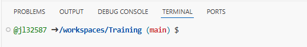

# Training
**Welcome to the Texas DSHS Bioinformatics training portal!**

Before starting the training, please create an account on GitHub:
https://docs.github.com/en/get-started/start-your-journey/creating-an-account-on-github

We will use GitHub Codespace for the training repo:
https://docs.github.com/en/codespaces/quickstart

Once you open the GitHub Codespace, you will see the Linux command prompt where we can type some basic Linux commands:



**BASIC LINUX COMMANDS**

Here is a short list of basic, but essential commands. In Linux, commands are case-sensitive and more often than not they are entirely in lowercase. Items that are surrounded by brackets ([]) are optional. 

```
ls              #  Lists directory contents. You will use ls to display information about files and directories.
```
```
cd [dir]        #  Changes the current directory to dir. If you execute cd without specifying a directory, cd changes the current directory to your home directory. This is how you navigate around the system.
```
```
pwd             #  Displays the present working directory name. If you don't know 
what directory you are in, pwd will tell you.
```
```
cat [file]      # Concatenates and displays files. This is the command you run to view the contents of a file.
```
```
echo [argument] # Displays arguments to the screen.
```

